# Digital Wallet — Low-Level Design (SOLID Principles)

---

## UML Class Diagram

```mermaid
classDiagram
    class Wallet {
        -String walletId
        -double balance
        +Wallet(walletId: String)
        +credit(amount: double) void
        +debit(amount: double) void
        +getBalance() double
        +getWalletId() String
    }

    class Transaction {
        -String transactionId
        -String fromWalletId
        -String toWalletId
        -double amount
        -TransactionStatus status
    }

    class TransactionStatus {
        <<enumeration>>
        SUCCESS
        FAILED
    }

    class WalletRepository {
        <<interface>>
        +findById(walletId: String) Wallet
        +save(wallet: Wallet) void
    }

    class WalletRepositoryImpl {
        -Map~String, Wallet~ wallets
        +findById(walletId: String) Wallet
        +save(wallet: Wallet) void
    }

    class TransactionRepository {
        <<interface>>
        +save(transaction: Transaction) void
        +getTransactions(walletId: String) List~Transaction~
    }

    class TransactionRepositoryImpl {
        -Map~String, List~ store
        +save(transaction: Transaction) void
        +getTransactions(walletId: String) List~Transaction~
    }

    class PaymentStrategy {
        <<interface>>
        +pay(amount: double) void
    }

    class UpiPayment {
        +pay(amount: double) void
    }

    class CardPayment {
        +pay(amount: double) void
    }

    class BankPayment {
        +pay(amount: double) void
    }

    class CryptoPayment {
        +pay(amount: double) void
    }

    class WalletService {
        <<interface>>
        +addMoney(walletId: String, amount: double, strategy: PaymentStrategy) void
        +transferMoney(from: String, to: String, amount: double) void
        +withdrawMoney(walletId: String, amount: double) void
        +getBalance(walletId: String) double
    }

    class WalletServiceImpl {
        -WalletRepository walletRepository
        -TransactionRepository transactionRepository
        +addMoney(walletId: String, amount: double, strategy: PaymentStrategy) void
        +transferMoney(from: String, to: String, amount: double) void
        +withdrawMoney(walletId: String, amount: double) void
        +getBalance(walletId: String) double
    }

    %% Relationships
    WalletRepositoryImpl     ..|> WalletRepository
    TransactionRepositoryImpl ..|> TransactionRepository
    UpiPayment               ..|> PaymentStrategy
    CardPayment              ..|> PaymentStrategy
    BankPayment              ..|> PaymentStrategy
    CryptoPayment            ..|> PaymentStrategy
    WalletServiceImpl        ..|> WalletService
    WalletServiceImpl        --> WalletRepository        : depends on
    WalletServiceImpl        --> TransactionRepository   : depends on
    WalletServiceImpl        ..> PaymentStrategy         : uses
    Transaction              --> TransactionStatus
    Wallet                   "1" --> "*" Transaction     : has
```



---

## Functional Requirements

- Create wallet
- Add money (via pluggable payment method)
- Transfer money between wallets
- Withdraw money
- Check balance
- View transaction history
- Support multiple payment methods: UPI, Card, Bank, Crypto
- Add new payment methods **without modifying existing code** (OCP)

---

## Models

### Wallet

```java
class Wallet {
    private String walletId;
    private double balance;

    public Wallet(String walletId) {
        this.walletId = walletId;
        this.balance = 0;
    }

    public void credit(double amount) {
        balance += amount;
    }

    public void debit(double amount) {
        if (balance < amount)
            throw new RuntimeException("Insufficient funds");
        balance -= amount;
    }

    public double getBalance() { return balance; }
    public String getWalletId() { return walletId; }
}
```

### Transaction

```java
class Transaction {
    private String transactionId;
    private String fromWalletId;
    private String toWalletId;
    private double amount;
    private TransactionStatus status;
}

enum TransactionStatus {
    SUCCESS,
    FAILED
}
```

---

## Repository Layer

```java
interface WalletRepository {
    Wallet findById(String walletId);
    void save(Wallet wallet);
}

interface TransactionRepository {
    void save(Transaction transaction);
    List<Transaction> getTransactions(String walletId);
}
```

### In-Memory Implementation

```java
class WalletRepositoryImpl implements WalletRepository {
    private Map<String, Wallet> wallets = new HashMap<>();

    @Override
    public Wallet findById(String walletId) {
        return wallets.get(walletId);
    }

    @Override
    public void save(Wallet wallet) {
        wallets.put(wallet.getWalletId(), wallet);
    }
}
```

---

## Strategy Pattern — Payment Methods

```java
interface PaymentStrategy {
    void pay(double amount);
}

class UpiPayment implements PaymentStrategy {
    public void pay(double amount) {
        System.out.println("Payment through UPI");
    }
}

class CardPayment implements PaymentStrategy {
    public void pay(double amount) {
        System.out.println("Payment through Card");
    }
}

class BankPayment implements PaymentStrategy {
    public void pay(double amount) {
        System.out.println("Payment through Bank");
    }
}

// OCP: new method, zero existing code touched
class CryptoPayment implements PaymentStrategy {
    public void pay(double amount) {
        System.out.println("Payment through Crypto");
    }
}
```

---

## Wallet Service

```java
interface WalletService {
    void addMoney(String walletId, double amount, PaymentStrategy paymentStrategy);
    void transferMoney(String fromWalletId, String toWalletId, double amount);
    void withdrawMoney(String walletId, double amount);
    double getBalance(String walletId);
}
```

### Implementation

```java
class WalletServiceImpl implements WalletService {

    private final WalletRepository walletRepository;
    private final TransactionRepository transactionRepository;

    public WalletServiceImpl(
            WalletRepository walletRepository,
            TransactionRepository transactionRepository) {
        this.walletRepository = walletRepository;
        this.transactionRepository = transactionRepository;
    }

    @Override
    public void addMoney(String walletId, double amount, PaymentStrategy paymentStrategy) {
        paymentStrategy.pay(amount);
        Wallet wallet = walletRepository.findById(walletId);
        wallet.credit(amount);
        walletRepository.save(wallet);
    }

    @Override
    public void transferMoney(String fromWalletId, String toWalletId, double amount) {
        Wallet sender   = walletRepository.findById(fromWalletId);
        Wallet receiver = walletRepository.findById(toWalletId);
        sender.debit(amount);
        receiver.credit(amount);
        walletRepository.save(sender);
        walletRepository.save(receiver);
        transactionRepository.save(new Transaction());
    }

    @Override
    public void withdrawMoney(String walletId, double amount) {
        Wallet wallet = walletRepository.findById(walletId);
        wallet.debit(amount);
        walletRepository.save(wallet);
    }

    @Override
    public double getBalance(String walletId) {
        return walletRepository.findById(walletId).getBalance();
    }
}
```

---

## Main

```java
public class Main {
    public static void main(String[] args) {
        WalletRepository walletRepo = new WalletRepositoryImpl();
        TransactionRepository txnRepo = new TransactionRepositoryImpl();
        WalletService walletService = new WalletServiceImpl(walletRepo, txnRepo);

        walletRepo.save(new Wallet("W1"));
        walletRepo.save(new Wallet("W2"));

        walletService.addMoney("W1", 1000, new UpiPayment());
        walletService.transferMoney("W1", "W2", 300);

        System.out.println(walletService.getBalance("W1")); // 700
        System.out.println(walletService.getBalance("W2")); // 300
    }
}
```

---

## SOLID Principles Applied

| Principle | How |
|-----------|-----|
| **SRP** | `Wallet` owns balance logic. `WalletRepository` / `TransactionRepository` handle persistence. `WalletService` owns business logic. `PaymentStrategy` owns payment. |
| **OCP** | Add `CryptoPayment` by implementing `PaymentStrategy` — no existing class is modified. |
| **LSP** | Any `PaymentStrategy` impl is interchangeable: `UpiPayment`, `CardPayment`, `CryptoPayment`. |
| **ISP** | Two focused repository interfaces instead of one bloated interface. |
| **DIP** | `WalletServiceImpl` depends on `WalletRepository`, `TransactionRepository`, and `PaymentStrategy` abstractions, never concrete classes. |

---

## Extension Points

- Transaction states machine (PENDING → SUCCESS / FAILED)
- Factory Pattern for `PaymentStrategy` creation
- Observer Pattern for notifications (email, push)
- Redis cache on wallet balance reads
- Fraud detection service (pluggable via decorator/chain of responsibility)
- Daily transaction limit enforcement
- Double-entry ledger system (Paytm / PhonePe style)